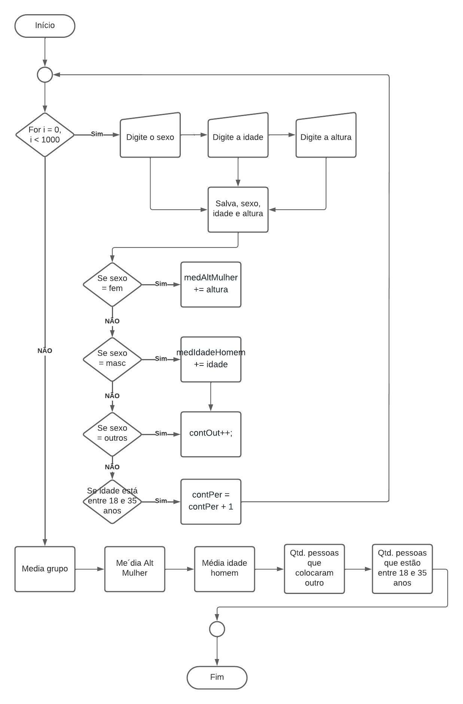

# Exercício 4 da AC2
Censo Demográfico

## Algoritmo do Exercício
    INÍCIO
        PARA i <- 0 até 1000, FAÇA
            ESCREVA(Digite o sexo (0-Fem / 1-Masc /2-Outro): )
            LER (sexo)
            ESCREVA(Digite a idade)
            LER (idade)
            ESCREVA(Digite a altura)
            LER (altura)

            SE sexo == 0, FAÇA
                medAltMulher += altura
            SE NÃO SE sexo == 1, FAÇA
                medIdadeHomem += idade
            SE NÃO SE sexo == 2, FAÇA
                contOut++
            FIM SE
            SE idade entre 18 e 35
                contPer = contPer + 1
            FIM SE
        FIM PARA
        ESCREVA(Media de idade)
        ESCREVA(Media da altura das mulheres)
        ESCREVA(Media de idade dos homens)
        ESCREVA(Pessoas que se identificaram como outro)
        ESCREVA(Percentual de pessoas com idade entre 18 e 35 anos)
    FIM

## Fluxograma

